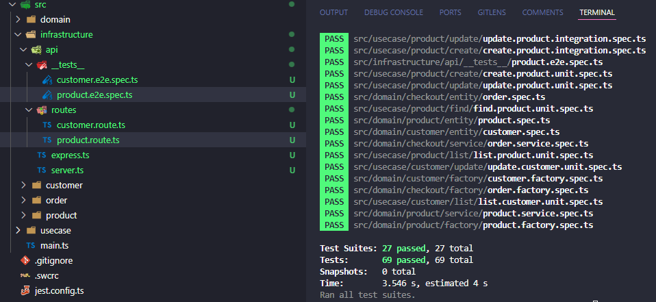

# Full Cycle 3.0

## Clean Architecture

### Challenges

#### 1 - Da mesma forma que fizemos a criação dos use cases realizando as operações: "create", "find", "list", "update" para "Customer", faça:

- Crie as operações mencionadas acima para nossa entidade: "Product".
- Implemente os testes de unidade e integração nos quatro use cases.
- A linguagem de programação para este desafio é TypeScript

### 2 - Da mesma forma que fizemos a listagem dos nossos Customers em nossa API, repita o mesmo processo e realize a listagem de Products. Não deixe de realizar o teste automatizado end-to-end.

- A linguagem de programação para este desafio é TypeScript

### Dependencies history

- `npm i typescript --save-dev`
- `npx tsc --init`
- `npm i tslint --save-dev`
- `npx tslint --init`
- `npm i -D jest @types/jest ts-node --save-dev`
- `npm i -D @swc/jest @swc/cli @swc/core`
- `npx jest --init`
- `npm i uuid @types/uuid`
- `npm i sequelize reflect-metadata sequelize-typescript`
- `npm i sqlite3`
- `npm i express @types/express dotenv`
- `npm i nodemon`
- `npm i -D @types/supertest`

### Commands

- `npm test`
- `npm run dev`
